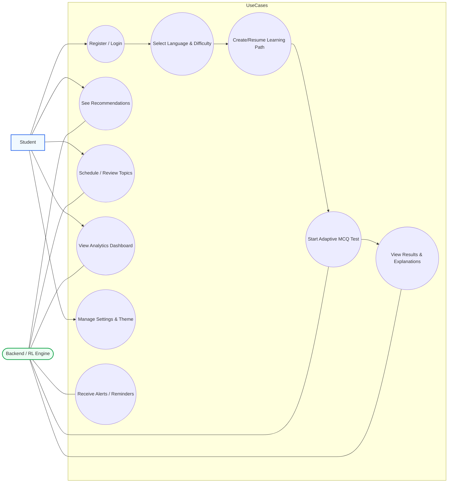
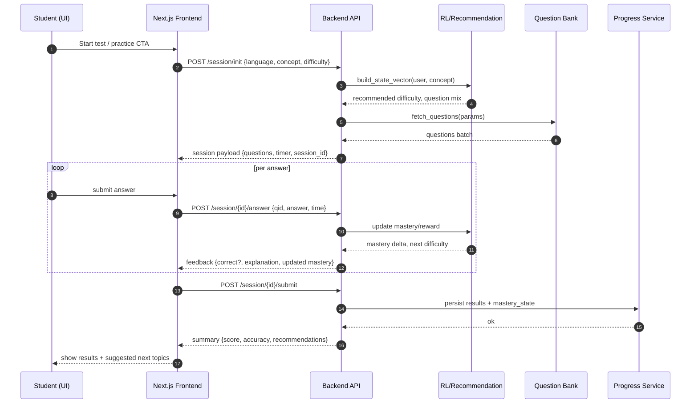
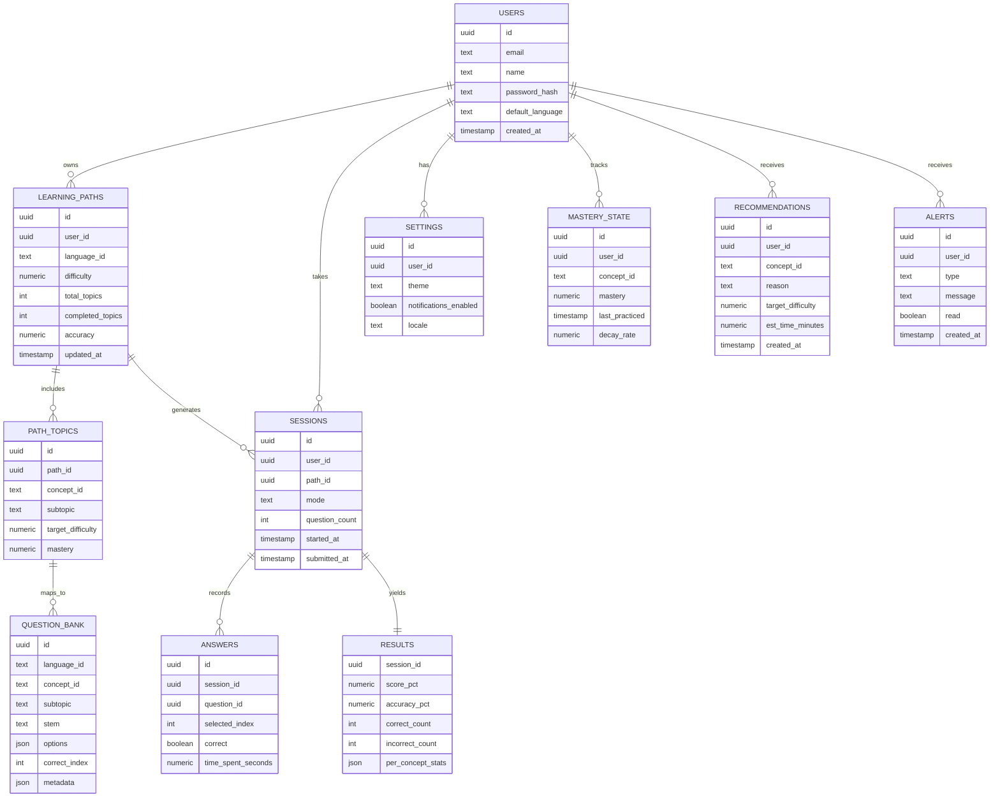
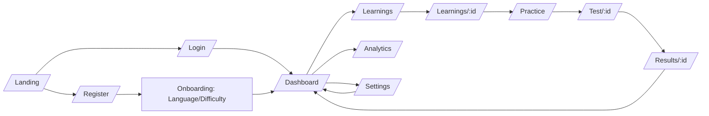
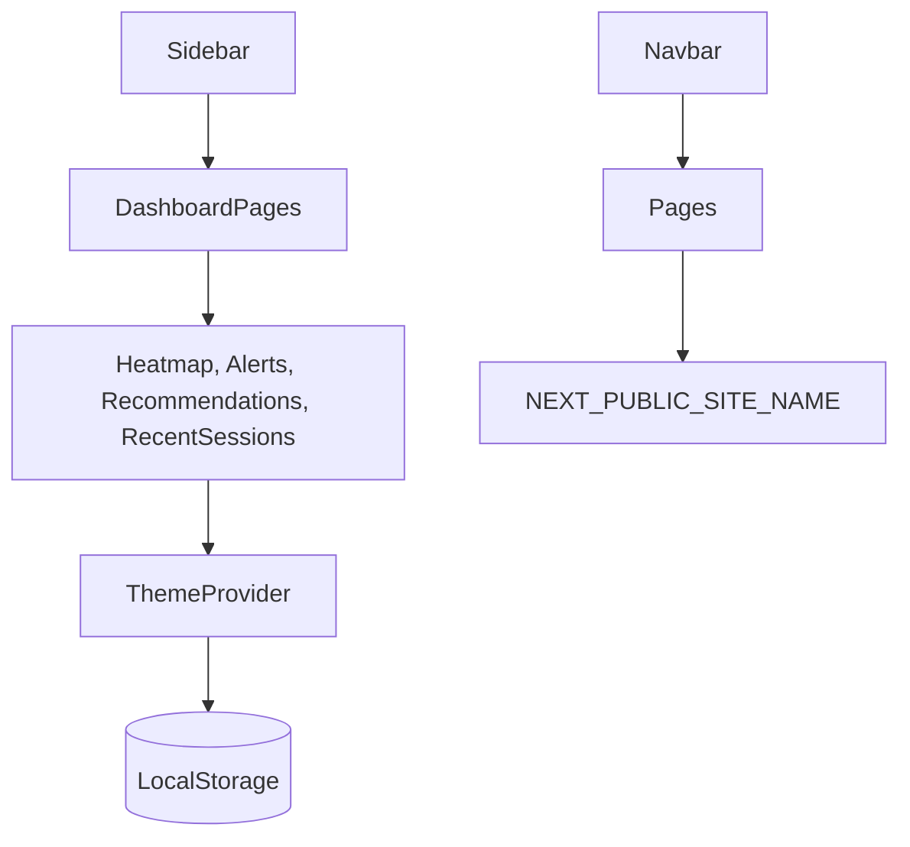

# System Diagrams

> Frontend-only prototype; backend, auth, and DB are conceptual. Update when backend contracts finalize.

## Use Case Diagram


## Sequence Diagram – Adaptive Test Session


## Activity Diagram – MCQ Session Flow
```mermaid
flowchart TD
  A[Start Session]-->B{Questions remaining?}
  B--No-->C[Show Summary]
  B--Yes-->D[Render Question + Options]
  D-->E{Timer running?}
  E--No-->F[Auto-submit unanswered]
  E--Yes-->G{Student selects option}
  G--No-->H[Allow navigation / pause?]
  H-->E
  G--Yes-->I[Send answer]
  I-->J[Receive correctness + explanation]
  J-->K[Update progress bar]
  K-->L[Update mastery / difficulty (RL)]
  L-->B
  C-->M[Display score, analytics, recommendations]
```

## Database Diagram (Conceptual)


## Flow Diagram – Navigation


## Component/Service Interaction (Frontend)

